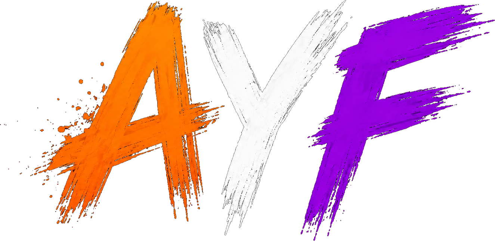
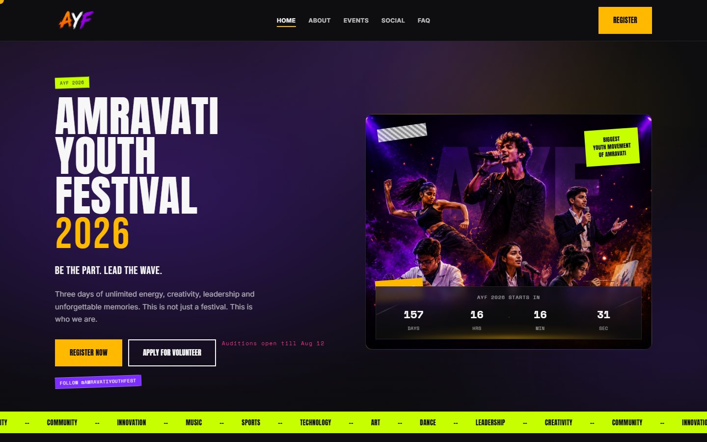
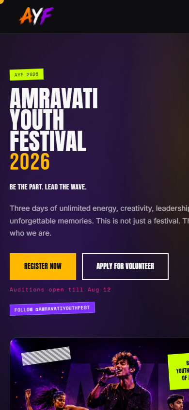
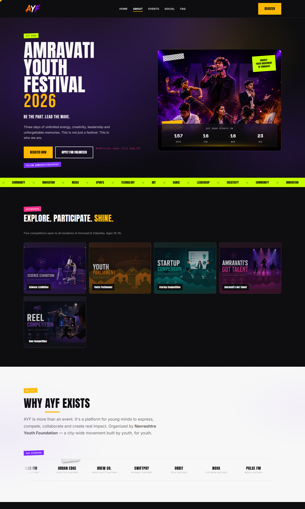

<div align="center">



# AYF 2026 — Amravati Youth Festival

**The largest youth cultural festival in Amravati, Maharashtra.**  
A full-stack event platform powering registrations, auditions, volunteers, and a live admin command centre — built with Next.js 15 + Supabase.

[](https://nextjs.org)
[](https://www.typescriptlang.org)
[](https://supabase.com)
[](https://vercel.com)

</div>

---

## ✨ What is AYF?

**Amravati Youth Festival (AYF)** is a premier cultural youth event organized by the **Navrashtra Youth Foundation**. The 2026 edition features 5 flagship competitions open to college students across Amravati and beyond.

| Competition | Category |
|---|---|
| 🔬 Science Exhibition | STEM Innovation |
| 🏛️ Youth Parliament | Debate & Leadership |
| 🚀 Startup Competition | Entrepreneurship |
| 🎤 Amravati's Got Talent | Performing Arts |
| 🎬 Reel Competition | Digital Content |

---

## 🖥️ Live Demo

> **Public site:** [ayf2026-chi.vercel.app](https://ayf2026-chi.vercel.app)  
> **Admin panel:** [ayf2026-chi.vercel.app/admin](https://ayf2026-chi.vercel.app/admin) *(admin role required)*

---

## 📸 Screenshots

### 🌐 Public Landing Page — Desktop (1440px)



### 📱 Mobile View (390px)



### 🖼️ Full Page Scroll



### 🛠️ Admin Panel

The admin panel (`/admin`) is protected by Google OAuth + role check. Sign in with an admin account to access:

| Page | Features |
|---|---|
| **Dashboard** | Stats cards, donut chart, trend line, activity feed |
| **Registrations** | Paginated table, inline status & slot edit, bulk actions, export |
| **Volunteers** | Application list, shortlisting, detail modal |
| **Profiles** | Read-only user list with XLSX export |
| **Competitions** | Cards with capacity bars, open/closed toggle |
| **Analytics** | 30-day SVG line charts, daily series |
| **Settings** | Toggle competition registration open/close |

---

## 🏗️ Architecture

```
AYF 2026
├── app/                        # Next.js App Router
│   ├── page.tsx                # Public landing page
│   ├── register/               # Registration & volunteer form
│   ├── auth/callback|confirm   # Supabase OAuth PKCE flow
│   ├── admin/                  # Admin dashboard + sub-pages
│   │   ├── registrations/
│   │   ├── volunteers/
│   │   ├── profiles/
│   │   ├── competitions/
│   │   ├── analytics/
│   │   └── settings/
│   └── api/admin/              # REST API routes (all admin-gated)
│       ├── stats/
│       ├── registrations/
│       ├── volunteers/
│       ├── profiles/
│       ├── competitions/
│       ├── analytics/
│       ├── settings/
│       ├── activity/
│       └── export/
├── src/
│   ├── components/             # Public + admin UI components
│   ├── utils/supabase/         # Browser + server Supabase clients
│   └── config/env.ts           # Zod-validated env schema
├── public/                     # Static assets & competition banners
├── supabase_schema.sql         # Initial DB schema + RLS policies
└── supabase_migration_v2.sql   # v2: competition_meta, audit_log, settings
```

---

## ⚙️ Tech Stack

| Layer | Technology |
|---|---|
| Framework | [Next.js 15](https://nextjs.org) (App Router, Webpack) |
| Language | TypeScript (strict) |
| Database | [Supabase](https://supabase.com) (PostgreSQL + RLS) |
| Auth | Supabase Auth — Google OAuth (PKCE flow) |
| Exports | [SheetJS (xlsx)](https://sheetjs.com) — CSV & Excel download |
| Fonts | Anton, Bebas Neue, Inter, Space Mono (Google Fonts) |
| Hosting | [Vercel](https://vercel.com) |

---

## 🗄️ Database Schema

```
profiles          — user info + role (user / admin)
competitions      — registration entries per user
volunteers        — volunteer applications
competition_meta  — master list with open/close flags  ⚠️ needs migration v2
admin_settings    — key/value store for toggles         ⚠️ needs migration v2
audit_log         — admin action trail                  ⚠️ needs migration v2
```

Row Level Security is enabled on all tables. Admin bypass is implemented via a `role = 'admin'` check in each RLS policy.

---

## 🚀 Getting Started

### 1. Clone & Install

```bash
git clone https://github.com/your-org/ayf2026.git
cd ayf2026
npm install
```

### 2. Configure Environment

```bash
cp .env.example .env.local
```

Fill in your Supabase credentials:

```env
NEXT_PUBLIC_SUPABASE_URL=https://your-project-id.supabase.co
NEXT_PUBLIC_SUPABASE_ANON_KEY=your-anon-public-key
# Optional — enables admin PATCH endpoints to bypass RLS
# SUPABASE_SERVICE_ROLE_KEY=your-service-role-key
```

### 3. Set Up the Database

Run the initial schema in your [Supabase SQL Editor](https://supabase.com/dashboard):

```sql
-- Run supabase_schema.sql first
-- Then run supabase_migration_v2.sql  (see Known Issues)
```

### 4. Run Locally

```powershell
npx next dev --webpack
```

Open [http://localhost:3000](http://localhost:3000)

### 5. Build & Start (Production)

```powershell
npx next build --webpack
npx next start -p 3000
```

---

## 🛡️ Admin Panel

The admin panel (`/admin`) is protected by:
1. **Middleware** — checks session cookie on every request
2. **Server-side** — `getAdminUser()` validates `role === 'admin'` per API route

### 7 Admin Pages

| Page | Features |
|---|---|
| **Dashboard** | Stats cards, competition donut chart, trend line, recent registrations, activity feed |
| **Registrations** | Paginated table, inline status & audition slot edit, bulk actions, detail modal, export |
| **Volunteers** | Application list, inline status edit, shortlisting, detail modal |
| **Profiles** | Read-only user list with export |
| **Competitions** | Cards with registration count, capacity bars, open/closed badge |
| **Analytics** | 30-day SVG line charts, daily series, status breakdowns |
| **Settings** | Toggle competition registration open/close *(requires migration v2)* |

---

## 🎨 Design System

### Public (Dark)

| Token | Value | Usage |
|---|---|---|
| `--ink` | `#0D0D0F` | Page background |
| `--orange` | `#FFB800` | Primary accent |
| `--purple` | `#7B2CFF` | Highlight |
| `--lime` | `#C6FF00` | Ticker / CTA |
| `--pink` | `#FF2E8A` | Accent |
| `--teal` | `#00E0D1` | Accent |

### Admin (Cream / Black)

| Token | Value | Usage |
|---|---|---|
| `--cream` | `#E8DFC8` | Admin backgrounds |
| `--card` | `#FBF8F0` | Admin card surfaces |
| `--admin-black` | `#0A0A0A` | Sidebar |
| `--admin-lavender` | `#9C93D6` | Info badges |
| `--admin-orange` | `#FF5A1F` | Warning / action |
| `--admin-reject` | `#E0567A` | Rejected status |

**Typefaces:** Anton (display), Bebas Neue (taglines), Inter (body), Space Mono (labels)

**Decorative motifs:** Torn paper dividers, gaffer tape, halftone dots, paint accents, stage spotlight/particle animations, polaroid frames, noise texture overlay.

---

## 📦 Deploying to Vercel

```bash
npm i -g vercel
vercel        # first deploy
vercel --prod # subsequent production deploys
```

Set the same environment variables in the Vercel dashboard under **Project → Settings → Environment Variables**.

---

## ⚠️ Known Issues

| Issue | Impact | Fix |
|---|---|---|
| `competition_meta` table not created | Settings page empty; Competitions page falls back to group-by-name | Run `supabase_migration_v2.sql` in Supabase SQL Editor |
| Migration v2 seed data mismatch | Seeded competitions differ from live form competitions | Update seed data in migration before running |
| Supabase auth token expiry (1 hr) | Direct API hits may fail after expiry | Middleware refreshes on page load; force re-login for long sessions |

---

## 📁 Key Files

| File | Purpose |
|---|---|
| `supabase_schema.sql` | Initial tables, RLS policies |
| `supabase_migration_v2.sql` | `competition_meta`, `audit_log`, `admin_settings` |
| `app/globals.css` | All CSS variables & global styles |
| `src/utils/supabase/` | Supabase client (browser + server) |
| `src/utils/cache.ts` | In-memory 10s API response cache |
| `src/config/env.ts` | Zod-validated environment schema |
| `.env.example` | Environment variable reference |

---

## 🤝 Contributing

1. Fork the repo
2. Create a feature branch: `git checkout -b feature/my-feature`
3. Commit changes: `git commit -m "feat: add my feature"`
4. Push and open a PR

---

## 📄 License

© 2026 **Navrashtra Youth Foundation**. All rights reserved.

---

<div align="center">
  Made with ❤️ for the youth of Amravati
</div>
